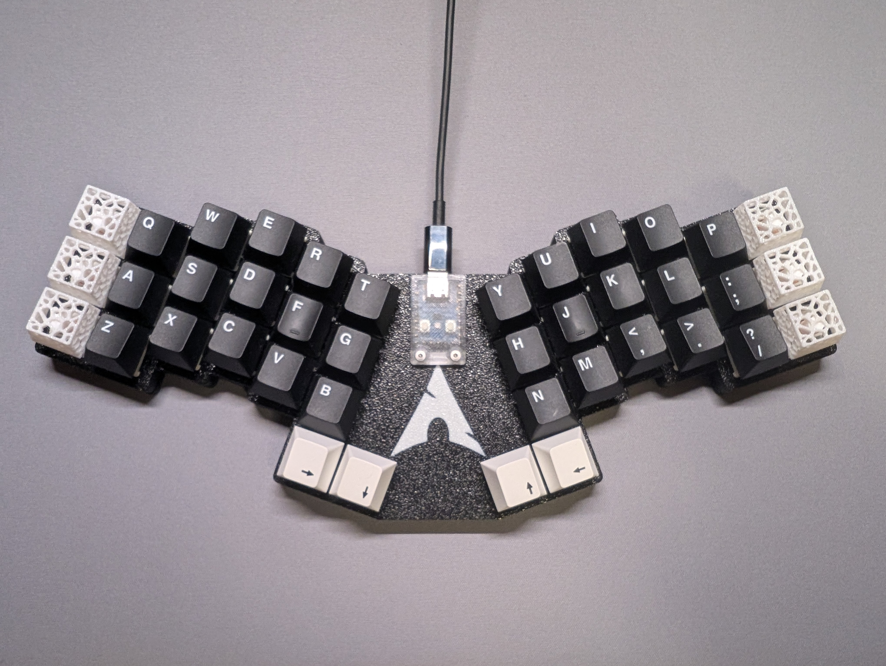
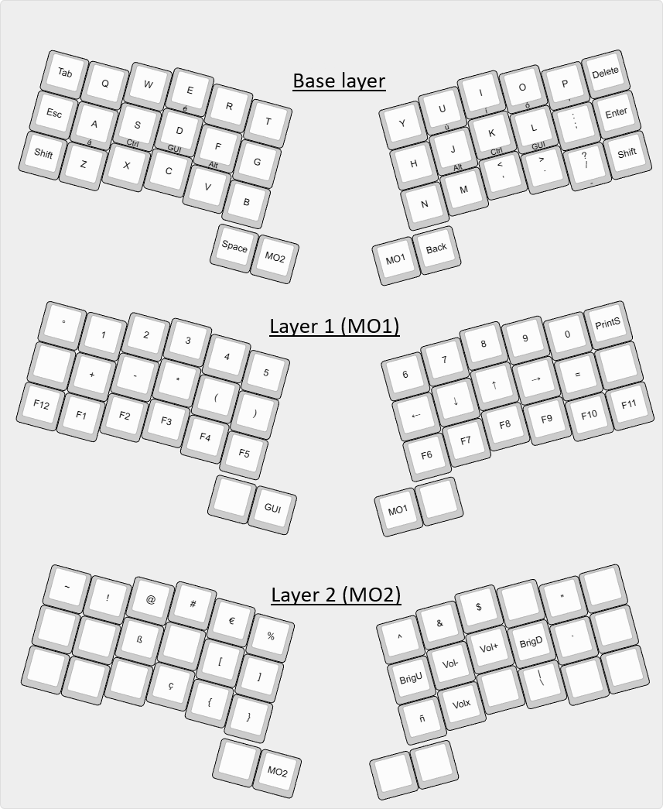

# Phenix40



Are you tired of proprietary switches, unnecessary software, layout quirks, and bulky keyboards? I was, so I decided to create my own.

The Phenix40 is a semi-split, layer-based, repairable, and ergonomic mechanical keyboard designed specifically for coding and writing. Unlike many DIY projects, this isn't a hand-wired mess, it features a custom PCB with hotswap sockets that fit any Cherry MX-style switch.

If you speak multiple languages, you know the struggle of typing awkward combinations or hunting online for characters like ß, ç, or ñ. This keyboard eliminates the frustration of "dead keys" for accents (especially in French and Spanish) and makes coding symbols like ~ and | instantly accessible.

Despite having only just 40 keys, it handles any Western European language symbol within one or two keystrokes. As long as you are using the Latin alphabet, you're covered.

### Layout: US_international
The firmware offers maximum compatibility, it work on any OS with keyboard support (Windows, Linux, Mac, Android, FreeBSD, etc). But you need to select the US_international layout, as it is the only one with all Western European characters.

## Layout



### Hidden characters:
- Home Row Modifiers and Special Characters (Hold the key):
  - S (LCtrl), D (GUI), F (LAlt) | J (RAlt), K (GUI), L (RCtrl)
  - A(ä), E(ë), I(ï), O(ö), U(ü), P('), and /(_)

- Double Tap for Accents:
  - A(á), E(é), I(í), O(ó), and U(ú)

While it may look intimidating, the layout is highly intuitive. You will retrain your muscle memory within 1–2 weeks. Once mastered, it is significantly faster and more ergonomic than a standard keyboard.

* Keyboard Maintainer: [AlonsoCid](https://github.com/AlonsoCid)
* Hardware Supported: *pi40_zero*
* Hardware Availability: *The PCB and case are original designs and are not yet publicly available.*

If using QMK MSYS, add this repository to your keyboards folder and run:
```Bash
qmk flash -kb phenix40 -km default
```

For Linux, Mac, or manual setups, see the [ QMK Build Environment Setup](https://docs.qmk.fm/#/getting_started_build_tools) and [Make Instructions](https://docs.qmk.fm/#/getting_started_make_guide) or the [Complete Newbs Guide](https://docs.qmk.fm/#/newbs).

## Bootloader

**Physical reset button**: Unscrew the chip cover, hold BOOT and press RESET. 
**Note**: Be aware this will wipe the firmware and reset the chip, use it only when the QMK terminal tells you to!

## Acknowledgments

Special thanks to [Pedro Dearo](https://github.com/Aracnoide) and Juan José López for their invaluable contributions to the design and hardware testing of this project.
